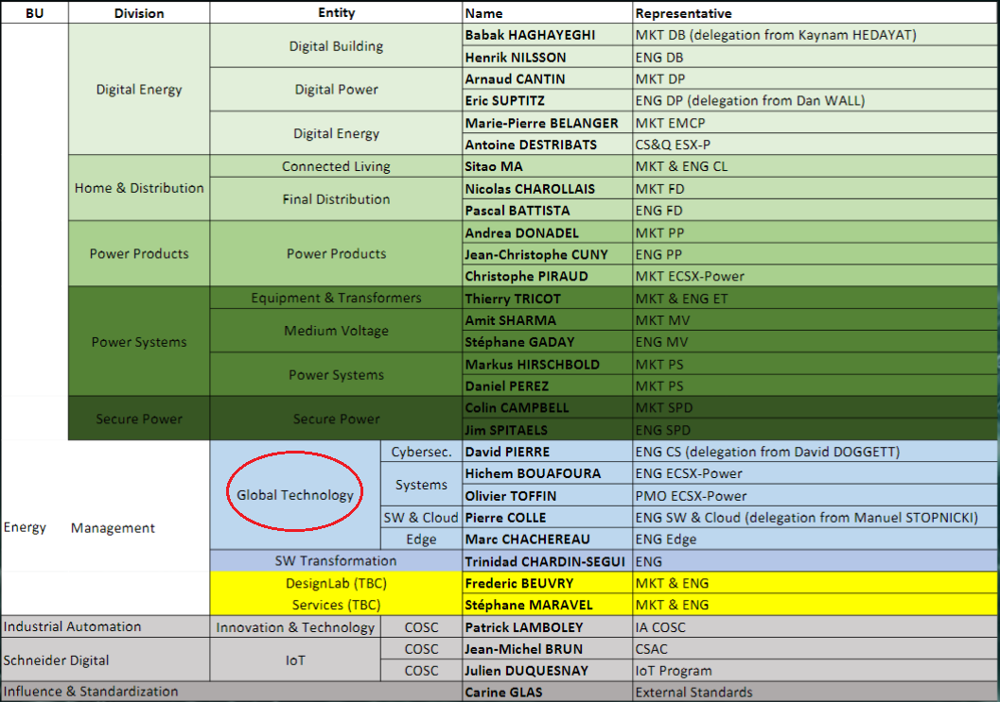

# Livrable 1 // CNAM [2020]
### By RISDORFER Quentin

**Formation :** L3 cybersécurité - CNAM occitanie

**Entreprise :** Schneider-Electric

**Tuteur d'entreprise :** VERNAY Bruno

**Tuteur de formation:** ???

| Version | date | Add |
|--------|--------|--------|
| 0.1 | 09/11/2020 | Structure |
| 0.2 | 12/11/2020 | About S.E |
| 0.3 | 16/11/2020 | Add Text |
| 0.4 | 23/11/2020 | Re-stucturation |

## Summary

**1. Introduction**

**2. About Schneider Electric**

**3. Work environment**

**4. Apprentissage**

**5. Missions**

**6. Conclusion**

**Annexe**

**Lien externe**

## 1. Introduction

Ce document est un rapport de présentation de l'entreprise Schneider-Electric, entreprise dans laquelle je travaille en alternance en tant qu'alternant ingénieur informatique en cybersécurité.

Nous présenterons dans un premier temps l'entreprise, son histoire, ses domaines d'activités ainsi que sa responsabilité par rapport à l'environnement et le bien-être de ses employés.

Nous développerons ensuite l'espace dans lequel j'évolue, mon apprentissage, mes missions ainsi que les outils utilisés.

Nous conclurons enfin sur l'intérêt que je porte à l'entreprise et les projets qui me sont proposés durant mon apprentissage.

## 2. About Schneider Electric

#### History :

Schneider Electric a été créé par les deux frères Eugène Schneider et Adolphe Schneider en France sous le nom de Schneider et Cie. Au début, cette entreprise exploitait les mines de charbon de Creusot en Saône-et-Loire. Elle était spécialisée dans la production d'acier pour la construction navale, les chemins de fer et l'armement.

En 1918, Schneider se lance dans le domaine de l'électricité tout en continuant ses activités dans les autres domaines.

Puis vers 1980, une période difficile pour l'entreprise, elle décide de se séparer de ses autres activités pour se recentrer dans le domaine de la gestion de l'électricité. L'arrivée de nouveaux fonds dans la société vers la fin des années 80 permit à Schneider de s'étendre via le rachat d'entreprises comme Télémécanique, Square D, Merlin Gerin ou encore Modicon.

Ce n'est qu'en 1999 que la firme se renomme Schneider Electric, nom qu'elle a conservé jusqu'à aujourd'hui, ce qui montre son intérêt pour l'électricité.

Depuis les années 2000, Schneider Electric connaît une forte croissance externe. Entre 2004 et 2014, c'est plus de 130 entreprises rachetées, pour un total de 15 milliards d'euros. La société est en forte croissance avec un chiffre d'affaires de plus de 25 milliards d'euros en 2018. C'est aussi 140 000 employés répartis dans plus de 100 pays différents, dont 49 000 en Europe.

Actuellement, Schneider Electric développe toujours son activité dans le domaine de l'électricité. Elle se focalise maintenant sur la distribution électrique et les automates.

#### Impact :

>"Nous fournissons des solutions énergétiques et d'automatismes numériques pour l'efficacité énergétique et le développement durable. Grâce à nos technologies uniques de gestion de l’énergie, d’automatismes en temps réel, de logiciels et de services, nous proposons des solutions intégrées pour l’habitat résidentiel, les bâtiments tertiaires, les data centers, les infrastructures et les industries. Nous rendons les processus et l'énergie sûrs et fiables, efficaces et durables, ouverts et connectés."

#### Solutions :

* Résidentiel
* Batîment
* industrie
* Energie et infrastructure
* Datacenter et réseaux
* efficacité énergétique

Schneider Electric est une entreprise internationale, connue dans le monde entier. Comme l'illustre la carte ci-dessus, cette entreprise vends dans le monde entier ses produits ; particulièrement dans l'hémisphère nord.

L’entreprise est aussi une actrice majeure dans le développement des techniques futures puisqu'elle investit environ 6 % de son chiffre d’affaires en recherche et développement.

Le principal centre d’innovation se trouve à Grenoble, plus précisément à Eybens, dans le site d'Electropole.

#### responsabilités :

Schneider-Electric prend position sur la transition vers une économie zéro carbone avec différentes actions:

* [*EcoStruxure*](https://www.se.com/fr/fr/work/campaign/innovation/overview.jsp?gclid=Cj0KCQiA48j9BRC-ARIsAMQu3WRWLX8NvN7ZoWu5U36ylAvbm4YePEPmadwpmLHVTMdzWbBXpD11PLsaAiMOEALw_wcB&gclsrc=aw.ds#xtor=SEC-1053-GOO-[EcoStruxure_Exact]-[461486676211]-S-[schneider%20electric%20ecostruxure]&utm_source=google&utm_purpose=marketo&utm_campaign=FR_202007_SEM_GlobalTransformationEcoStruxureBrand_Global_BRTextFR&utm_term=schneider%20electric%20ecostruxure) déployant des systèmes de distribution électrique éconénergétique ayant pour but l'analyse de la consommation énergétique du client pour engendrer des économie d'énergie. Ce service propose aussi des applications pour analyser et gerer l'installation chez le client. 

  * *Jusqu'à 15% de réduction des coûts d'entretien*
  * *Jusqu'à 10% de réduction des coûts énergétique*
  * *Jusqu'à 15% de réduction des coûts de projets*

* [*L'écolabel Green Premium*](https://www.se.com/fr/fr/work/support/green-premium/) sur les produits Schneider fournit des informations sur les substances dangereuses, leur impact environnemental ainsi que les instructions de fin de vie.

* Schneider Electric s'est engagé à atteindre les [17 objectifs de développement durable des Nations Unies](https://fr.wikipedia.org/wiki/Objectifs_de_d%C3%A9veloppement_durable) à travers ses principales activités et solutions.
Ses [résultats](https://www.se.com/ww/fr/about-us/sustainability/) sont publiés tous les trimestres, par le biais du rapport Schneider Sustainability Impact 2018-2020.
Ce dernier révèle les engagements ainsi que la contribution aux objectifs de développement durable des Nations Unies.

## 3. Work environment

#### Electropole Schneider at Grenoble

* **Organisation**

**Organigramme de ma hiérarchie**

Jean-Pascal TRICOIRE (Chief Executive Officer)

Philippe DELORME (EVP Energy Management)

Bruno ZERBIB ( Chief Technology & Digital Officier)

Marc CHECHEREAU (Global Technology Organization, VP)

Laurent DEPEISSES (Embedded Software, Technical Manager)

Quentin RISDORFER (moi)

Le directeur du site est Jean-Christophe Deschamps. Mon équipe à pour nom **Technology Actions**. Elle se situe dans **Energy Management** dans le secteur **Global Technology**.

<ins>**Organigramme des pôles d'activités :**</ins>

* **Secteur d'activité**

L'équipe que j'ai intégrée est composée d'une cinquantaine de personnes réparties dans le monde (France, Chine, Inde). L'objectif de cette équipe est de travailler sur la recherche et le développement de nouvelles technologies afin de créer ou d'améliorer plusieurs produits Schneider. Globalement, nous travaillons sur la mise en place de systèmes embarqués pour la réception et la gestion de données sur différents produits Schneider.

Que ce soit sur la couche Hardware, Software ou encore le réseau, il y a un aspect cybersécurité de la conception de la solution jusqu'au déploiement de celle-ci. J'ai donc un grand choix de sujets en rapport avec la sécurité sur lesquel me pencher.

* **Horaires / Télétravail**

L'accès au site est possible du lundi au vendredi, de 6h55 à 20h30 via le parking du personnel. Différents services sont présent sur le site comme un restaurant, un acceuil et point relais ou encore une salle de sport et des vestiaires.

Mon trajet de mon domicile jusqu'à l'entreprise est de 5 minutes en voiture. J'arrive en entreprise à 8h30. Je mange au self de l'entreprise aux alentours de midi pour reprendre le travail vers 13h00. Je termine ma journée à 17h00.

Dans le cadre de la crise du Covid-19, j'effectue un jour de télétravail chaque vendredi afin de limiter le contact avec d'autres personnes.

* **Matériel**

Pour mener à bien mon apprentissage, l'entreprise me fournit un ordinateur portable. Nous avons la possibilité de brancher notre ordinateur sur un deuxième écran disponible sur les tables de l'open-space. Je peux demander des outils particuliers afin de mener à bien mon travail. Nous pouvons nous isoler dans des bulles si cela est possible et nous avons différentes salles de réunion pour se regrouper.

## 4. apprentissage

Toutes les connaissances en rapport aux travaux et l'apprentissage de diverses technologies sont présente sur mon [github](https://github.com/ElPoulpi) afin de garder une trace écrite de mes connaissances acquise lors de mon apprentissage. Nous traiterons mes connaissances acquisent aux travers de ces répôts.

* **LSM_Yocto**

*Documentation / Apprentissage concernant les modules de sécurité Linux (LSM) et l'utilisation de Yocto pour la création d'images*

Ce sujet est très vaste et très important. L'utilisation de Yocto permet de créer des images pour les implanter dans des solutions hardware embarqué. Une fois l'outil maîtrisé, il me faut prendre connaissance des solutions de sécurité Linux, appelées LSM (Linux Security Module), afin de renforcer l'aspect sécurité de l'image dans le produit final.

* **Trust_zone_ARM**

*Isolation hardware qui permet d'avoir un environnement 'non-secure' et un environnement 'secure' afin de protéger les données sensibles et les applications critiques.*

C'est un sujet actuellement traité dans l'équipe. Il est important que je prenne connaissance de cette technologie afin d'interragir avec les personnes travaillant dessus et pour pouvoir à mon tour comprendre et apporter des solutions de sécurité.

* **Zero_Touch_Provisionning**

*Sujet prometteur basé sur le principe du zero touch provisionning, CAD le device s'installe et se configure en fonction du besoin directement et automatiquement après sa mise en route chez le client*

Cette partie est de la prise de connaissances sur le sujet. Le but étant un jour de le présenter comme solution si l'on vient à se pencher dessus dans l'équipe.

## 5. Missions

* **Parenthèse d'analyse de qualité de code source**

Une équipe doit choisir des solutions de programmation. On doit évaluer la qualité de ces solution via l'axe de la qualité du code source. Surtout d'un point de vu sécurité.

<ins> Outils </ins>: Klockwork; SQuORE;

## 6. Conclusion

Ma première expérience dans le monde du travail au sein de Schneide-Electric m'a conforté dans mon envie d'évoluer dans le domaine de la cybersécurité. Cette mise en application montre que ce domaine est indispensable dans la majorité des projets informatiques. L'équipe dans laquelle j'évolue m'a très vite intégrée et m'a proposé plusieurs possibilités de travaux afin d'approfondir mes connaissances et mettre en pratique ce que j'ai appris.

Au travers de ces premiers mois chez Schneider-Electric j'ai acquis de l'autonomie, de la maturité et des compétences dans mon domaine d'activité. Je suis ravi de continuer à m'épanouir professionnellement chez eux.

---

### External Links

[Site officiel Schneider Electric](https://www.se.com/fr/fr/)

[Site officiel du CNAM Occitanie](https://www.cnam-occitanie.fr/)

[Licence L3 cybersécurité [PDF]](https://www.cnam-occitanie.fr/medias/fichier/cnam-occitanie-l3-informatique-generale-et-certificat-analyste-en-cybersecurite-alternance-20202021_1591364344259-pdf?ID_FICHE=1084991&INLINE=FALSE)

[EcoStruxure Schneider-Electric](https://www.se.com/fr/fr/work/campaign/innovation/overview.jsp?gclid=Cj0KCQiA48j9BRC-ARIsAMQu3WRWLX8NvN7ZoWu5U36ylAvbm4YePEPmadwpmLHVTMdzWbBXpD11PLsaAiMOEALw_wcB&gclsrc=aw.ds#xtor=SEC-1053-GOO-[EcoStruxure_Exact]-[461486676211]-S-[schneider%20electric%20ecostruxure]&utm_source=google&utm_purpose=marketo&utm_campaign=FR_202007_SEM_GlobalTransformationEcoStruxureBrand_Global_BRTextFR&utm_term=schneider%20electric%20ecostruxure)

[L'écolabel Green Premium](https://www.se.com/fr/fr/work/support/green-premium/)

[17 objectifs de développement durable des Nations Unies](https://fr.wikipedia.org/wiki/Objectifs_de_d%C3%A9veloppement_durable)

[développement Durable Schneider-Electric](https://www.se.com/ww/fr/about-us/sustainability/)

[Github personnel](https://github.com/ElPoulpi)
